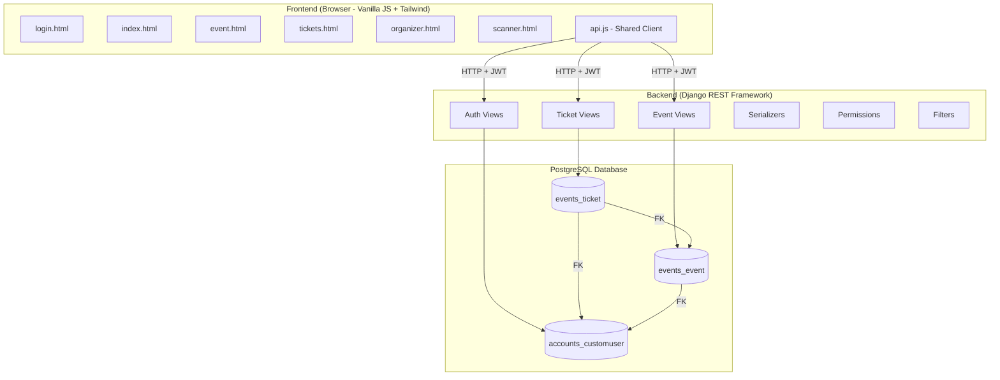
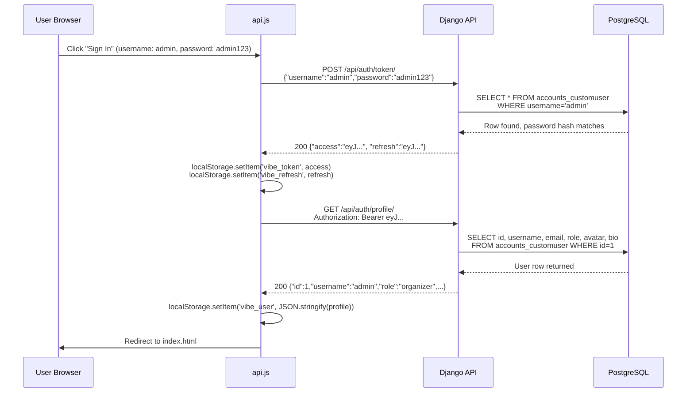
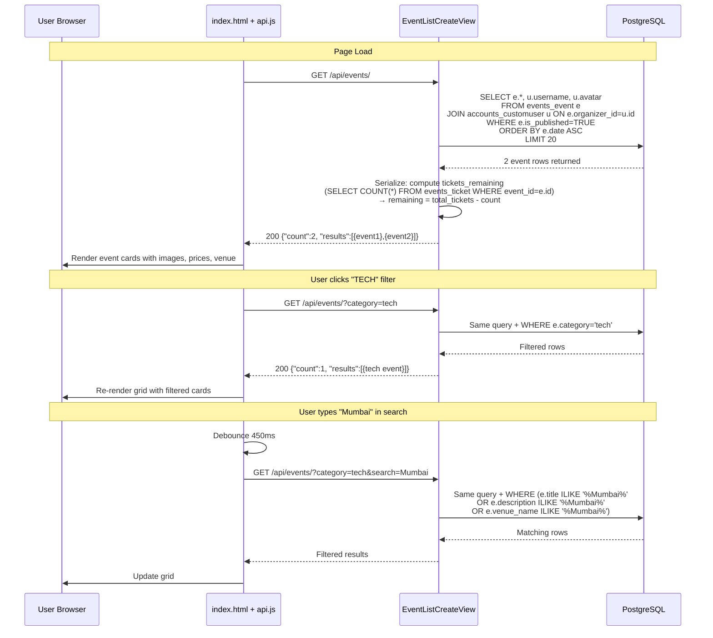
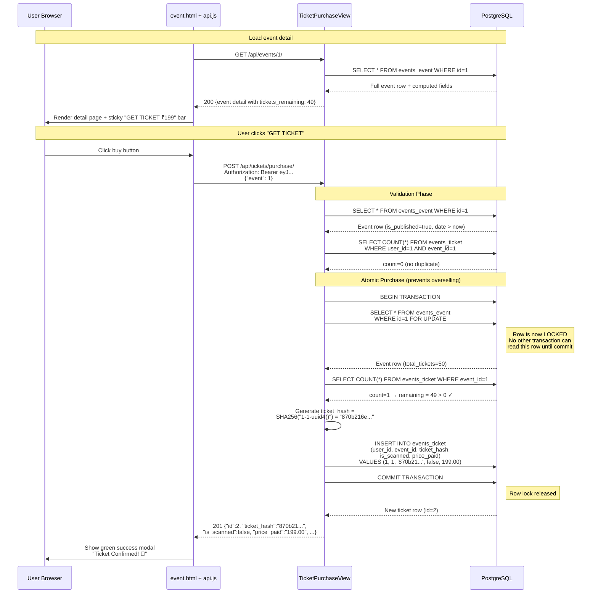
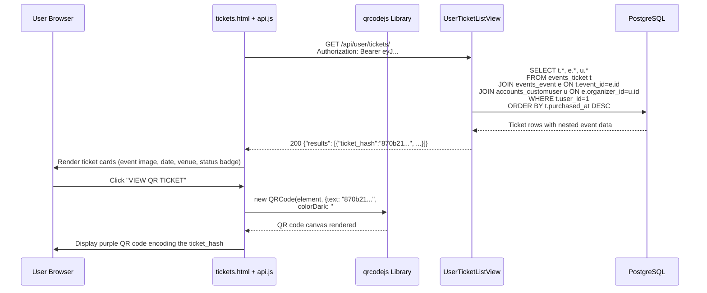
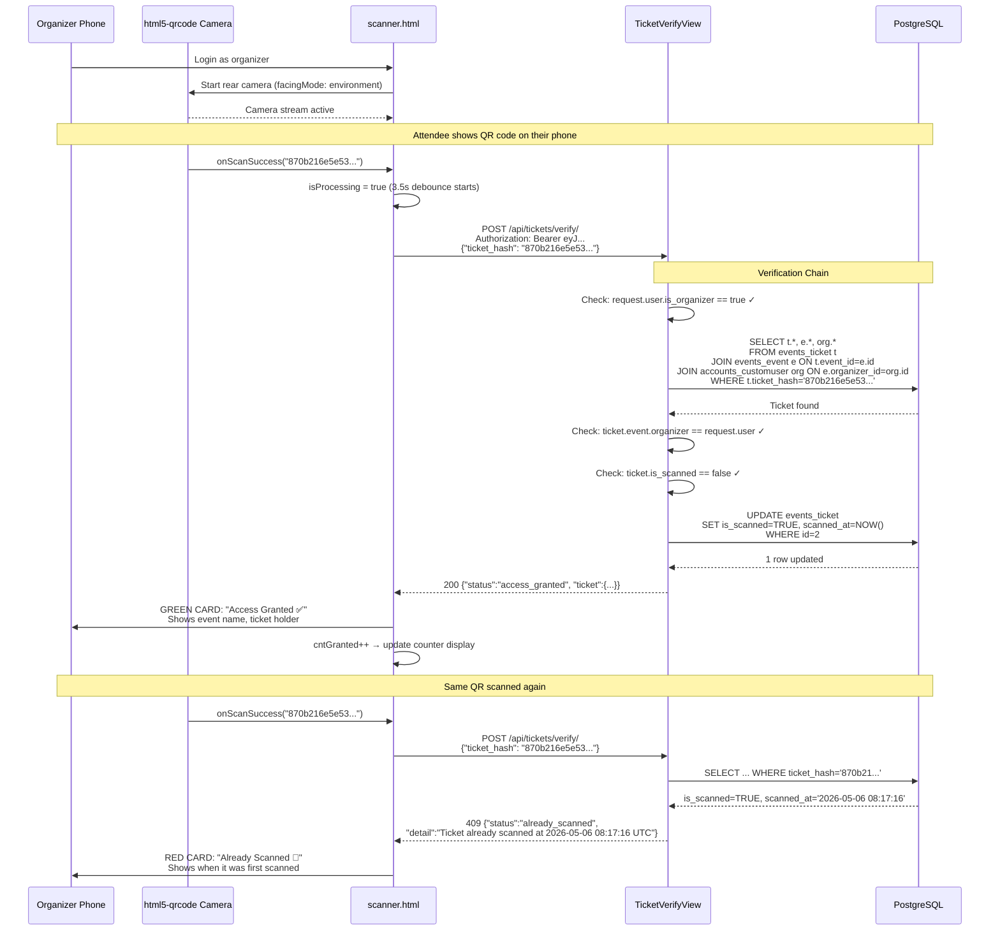
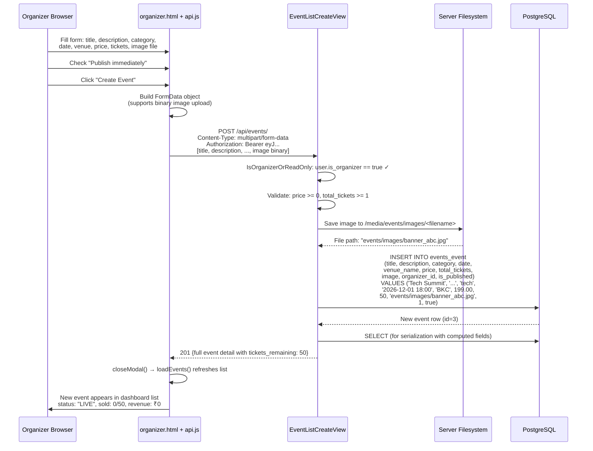
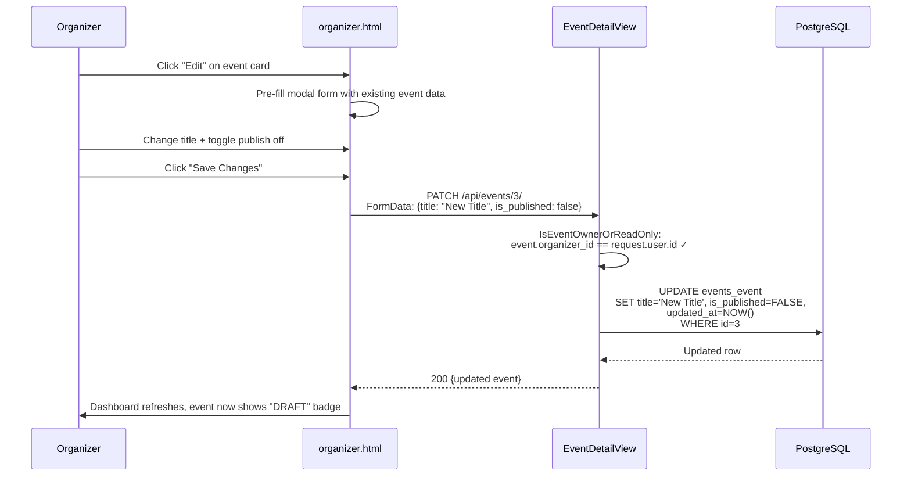
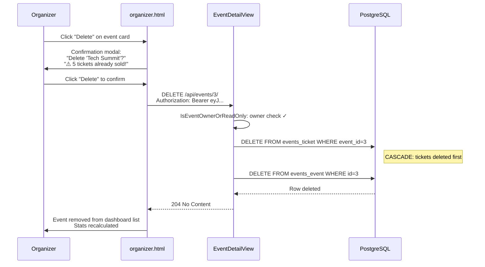
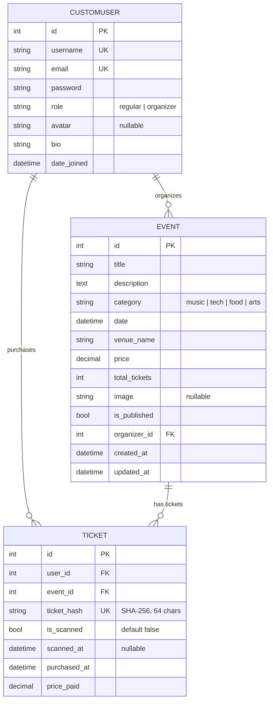

# Vibe Check — Complete Working Flow Document

> This document traces every user action through the **three layers** of the application:
> **Frontend (HTML/JS)** → **Backend API (Django REST)** → **Database (PostgreSQL)**

---

## SYSTEM ARCHITECTURE



---

## FLOW 1: USER REGISTRATION & LOGIN

### What the user does
Opens `login.html` → types username & password → clicks "Sign In"

### Step-by-step data journey



### What gets stored

| Layer | Where | What |
|---|---|---|
| Browser localStorage | `vibe_token` | JWT access token (expires 2 hours) |
| Browser localStorage | `vibe_refresh` | JWT refresh token (expires 7 days) |
| Browser localStorage | `vibe_user` | `{"id":1,"username":"admin","role":"organizer",...}` |
| Database | No change | Login does not write to DB — read-only verification |

### Token refresh (automatic, invisible to user)

When any API call returns `401`:
1. `api.js` calls `POST /api/auth/token/refresh/` with the stored refresh token
2. Backend validates refresh token → returns new access token
3. `api.js` stores new access token → retries the original request
4. User never sees a login screen (unless refresh token also expired)

---

## FLOW 2: BROWSING & DISCOVERING EVENTS

### What the user does
Opens `index.html` → sees event cards → clicks category pill "TECH" → types "Mumbai" in search

### Step-by-step data journey



### What gets returned per event

```json
{
  "id": 1,
  "title": "Tech Meetup Mumbai",
  "category": "tech",
  "category_display": "Tech",         // ← Python: get_category_display()
  "date": "2026-06-15T18:00:00Z",
  "venue_name": "Bandra Kurla Complex",
  "price": "199.00",
  "image": null,
  "organizer": {
    "id": 1,
    "username": "admin",
    "first_name": "",
    "last_name": "",
    "avatar": null
  },
  "tickets_remaining": 49,            // ← Python: total_tickets - tickets.count()
  "is_upcoming": true,                // ← Python: date > timezone.now()
  "is_published": true
}
```

---

## FLOW 3: BUYING A TICKET

### What the user does
On `event.html` → clicks "GET TICKET" → sees success modal → goes to My Tickets

### Step-by-step data journey



### What gets written to database

**`events_ticket` — new row inserted:**

| Column | Value | Source |
|---|---|---|
| `id` | 2 | Auto-increment |
| `user_id` | 1 | From JWT token (`request.user`) |
| `event_id` | 1 | From request body `{"event": 1}` |
| `ticket_hash` | `870b216e5e53...` | SHA-256 of `"1-1-<uuid4>"` |
| `is_scanned` | `false` | Default |
| `scanned_at` | `NULL` | Not scanned yet |
| `purchased_at` | `2026-05-06 08:17:16 UTC` | Auto `now()` |
| `price_paid` | `199.00` | Snapshot of `event.price` at purchase time |

### Why `select_for_update()` matters

Without it, if 2 users buy the last ticket at the same millisecond:
```
Thread A: reads remaining = 1 ✓ → creates ticket → remaining = 0
Thread B: reads remaining = 1 ✓ → creates ticket → remaining = -1 ❌ OVERSOLD
```
With `select_for_update()`:
```
Thread A: LOCKS event row → reads remaining = 1 ✓ → creates ticket → COMMIT
Thread B: WAITS for lock → reads remaining = 0 ❌ → gets "sold out" error
```

---

## FLOW 4: VIEWING MY TICKETS + QR CODE

### What the user does
Opens `tickets.html` → sees ticket cards → taps "VIEW QR TICKET" → QR code appears

### Step-by-step data journey



### How the QR code gets its data

```
Database ticket_hash column: "870b216e5e5320bbfea51a7ff6c1cfa99d58129f5ff7bc38bc91c626b324b615"
     ↓
API returns it in JSON response as ticket.ticket_hash
     ↓
Frontend JS passes it to qrcodejs library
     ↓
Library renders it as a visual QR code on an HTML canvas
     ↓
The QR code, when scanned by any reader, outputs the same 64-char hash string
```

---

## FLOW 5: SCANNING A TICKET AT THE DOOR

### What the organizer does
Opens `scanner.html` → logs in → camera activates → points at attendee's QR → sees "Access Granted" (green) or "Already Scanned" (red)

### Step-by-step data journey



### What changes in the database

**Before scan:**

| ticket_hash | is_scanned | scanned_at |
|---|---|---|
| `870b216e5e53...` | `false` | `NULL` |

**After scan:**

| ticket_hash | is_scanned | scanned_at |
|---|---|---|
| `870b216e5e53...` | `true` | `2026-05-06 08:17:16.890507+00` |

---

## FLOW 6: ORGANIZER CREATES AN EVENT

### What the organizer does
Opens `organizer.html` → clicks "NEW EVENT" → fills form + uploads banner image → clicks "Create Event"

### Step-by-step data journey



### What gets written to database

**`events_event` — new row:**

| Column | Value |
|---|---|
| `id` | 3 |
| `title` | "Tech Summit" |
| `description` | "Join us for..." |
| `category` | "tech" |
| `date` | `2026-12-01 18:00:00+00` |
| `venue_name` | "BKC" |
| `price` | `199.00` |
| `total_tickets` | 50 |
| `image` | `events/images/banner_abc.jpg` |
| `organizer_id` | 1 (from JWT) |
| `is_published` | `true` |
| `created_at` | auto |
| `updated_at` | auto |

---

## FLOW 7: ORGANIZER EDITS & DELETES EVENT

### Edit flow



### Delete flow



---

## COMPLETE DATA RELATIONSHIP MAP



---

## FRONTEND → API → DATABASE MAPPING

| Frontend Page | User Action | API Call | Database Effect |
|---|---|---|---|
| `login.html` | Click "Sign In" | `POST /api/auth/token/` | READ `accounts_customuser` |
| `index.html` | Page loads | `GET /api/events/` | READ `events_event` + JOIN user |
| `index.html` | Click category pill | `GET /api/events/?category=tech` | READ with WHERE filter |
| `index.html` | Type in search | `GET /api/events/?search=mumbai` | READ with ILIKE search |
| `event.html` | Page loads | `GET /api/events/1/` | READ single event + ticket count |
| `event.html` | Click "Get Ticket" | `POST /api/tickets/purchase/` | INSERT `events_ticket` (with row lock) |
| `tickets.html` | Page loads | `GET /api/user/tickets/` | READ `events_ticket` WHERE user_id=me |
| `tickets.html` | Tap "VIEW QR" | No API call | QR rendered client-side from stored hash |
| `scanner.html` | Camera reads QR | `POST /api/tickets/verify/` | UPDATE `events_ticket` SET is_scanned=TRUE |
| `organizer.html` | Page loads | `GET /api/organizer/events/` | READ events WHERE organizer_id=me |
| `organizer.html` | Click "New Event" | `POST /api/events/` | INSERT `events_event` |
| `organizer.html` | Click "Edit" | `PATCH /api/events/3/` | UPDATE `events_event` |
| `organizer.html` | Click "Delete" | `DELETE /api/events/3/` | DELETE `events_event` + CASCADE tickets |
